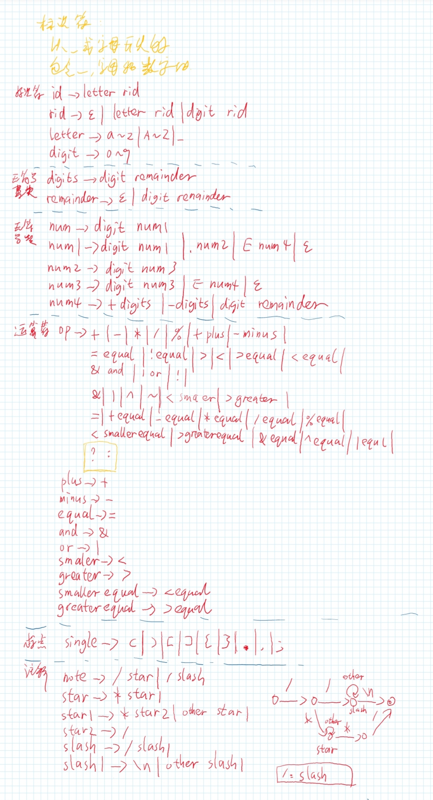

# C语言词法分析程序的设计与实现实验报告

[TOC]


## 题目：词法分析程序的设计与实现

## 实验内容：设计并实现 C 语言的词法分析程序，要求实现如下功能。

1. 可以识别出 C 语言编写的源程序中的每个单词符号，并以记号的形式输出每个单词符号。
2. 可以识别并跳过源程序中的注释。
3. 可以统计源程序中的语句行数、各类单词的个数、以及字符总数，并输出统计结果。
4. 检查源程序中存在的词法错误，并报告错误存在的位置。
5. 对源程序中出现的错误进行适当的恢复，使词法分析可以继续进行，对源程序进行一次扫描，即可检查并报告源程序中存在的所有词法错误。

## 实现要求：分别用以下两种方法实现

方法1：采用 C/C++ 作为实现语言，手工编写词法分析程序。**（已实现）**

方法2：编写 LEX 源程序，利用 LEX 编译程序自动生成词法分析程序。**（已实现）**

## 程序设计说明

本程序所指的 C 语言为 C11（指 ISO 标准 ISO/IEC 9899:2011）的一个子集。

程序的主体是一个自动机，根据自动机当前的状态和当前的输入决定下一步转移的状态和执行的操作。

自动机主要的状态有起始态、标识符态、数字态、各种运算符态、注释态、字符串态和预处理态。

起始态根据当前的输入转移到相应的状态，如果输入是字母或下划线则转移到标识符态；如果是数字则转移到数字态；如果是运算符则看该运算符是否可以组成有多个字符组成的运算符，如果可以则转移到相应的运算符态进一步处理，否则则识别该运算符并返回起始态；如果是双引号则转移到字符串态；如果是井号则转移到预处理态。

标识符态根据当前的输入转移到相应的状态，如果输入是字母、下划线或数字则转移到标识符态，否则回退、识别 token、判断是不是关键字并返回初始态。

数字态根据当前的输入转移到相应的状态，分别处理输入是数字、小数点、E和其他字符的情况。

各种运算符态根据已识别到的字符和输入的字符确定是否能识别到唯一的运算符，如果可以则识别token并返回起始态，否则转移到下一个状态继续分析。运算符态如果已经识别到斜杠并且输入的字符是斜杠或者星，则转移到注释态。

注释态根据当前的输入转移到相应的状态，如果输入是注释结束符则转移到相应的状态，否则转移到注释态继续处理。

字符串态根据当前的输入转移到相应的状态，如果输入是双引号则识别 token 并转移到起始态，否则转移到字符串态继续处理。

预处理态根据当前的输入转移到相应的状态，如果输入是换行符则 token 并转移到起始态，否则转移到预处理态继续处理。

### 文法设计



### C/C++ 版本

程序由一个主函数，一个分析函数和若干辅助函数组成。主要函数设计如下：

#### int main(int argc, char* argv[])

主函数负责命令行参数解析以选定被分析程序、打开和关闭输入输出文件、调用分析函数完成分析和将分析结果输出。

#### int lexicalAnalysis()

分析函数负责分析被分析程序得出分析结果。

本函数是程序的主体，由一个自动机组成，根据自动机当前的状态和当前的输入决定下一步转移的状态和执行的操作，从而识别 token 和记录信息。

自动机的描述在本章开头已经叙述，详细的实践请见源程序。

#### int getChar()

获取字符函数负责从被分析程序中获取一个字符或者从被退回的字符中获取一个字符，获取的字符保存在char类型全局静态变量ch中。同时该函数还维护当前读取到被分析程序的第几行第几列的信息。

#### int getNbc()

获取非空格字符函数负责检测char类型全局静态变量ch是否为空格，如果是则调用int getChar()函数直到ch不为空格为止。

#### int cat()

拼接函数负责向 token 插入字符 ch。

#### bool isLetter()

判断字母函数负责判断字符 ch 是否为字母 a~z, A~Z 或者 _，如果是则返回1，否则返回0。

#### bool isDigit()

判断数字函数负责判断字符 ch 是否为数字 0~9，如果是则返回1，否则返回0。

#### int retract()

回退函数负责将当前处理的字符回退到上一个字符。

#### bool isReserve()

判断关键字函数负责判断 token 是否为关键字，如果在关键字映射 keyword 中找到 token 则表明 token 是关键字并返回1，否则表明 token 不是关键字并返回0。

#### int SToI()

将 token 转换成 int 并返回。

#### int SToF()

将 token 转换成 float 并返回。

#### int tableInsert()

插入函数负责将 token 插入标识符表 table 中。

#### int returnError()

错误处理函数负责将发生错误的位置信息保存到错误日志中。

#### int returnToken(int type)

token 处理函数负责将 token 的类型、原文和位置信息保存到结果日志中。

#### std::string typeCount2str()

统计转换函数负责将 token 统计映射 typeCount 中的信息转换成字符串并返回。

### LEX 版本

Lex 程序由三部分组成：声明部分、转换规则和辅助函数。

声明部分定义标识符和所对应的字符串生成方法，定义和 C/C++ 程序设计的一样。

转换规则部分定义了识别对应的标识符后所执行的操作，返回的信息。

辅助函数部分定义了主函数和输出函数。

## 源程序

### C/C++ 版本

#### LexicalAnalysis/source/lexicalAnalysis.cpp

```
#include "lexicalAnalysis.hpp"

/****************************************************************
 * main
 */
int main(int argc, char* argv[]) {
    std::string programName("hello");

    int c = 0; 
    while(EOF != (c = getopt(argc,argv,"p:"))){
        switch(c){
            case 'p':
                programName = optarg;
                break;
            case '?':
                printf("-p <file>.c to specify demo program file\n");
                break;
            default:
                break;
        }
    }

    // Plan a: Don't work.
    std::string programPath("./demo/" + programName + ".c");
    program.open(programPath.c_str());

    // Plan b: Work.
    freopen(programPath.c_str(), "r", stdin);

    std::string resultPath("./result/" + programName + ".txt");
    result.open(resultPath.c_str());

    lexicalAnalysis();
    
    result << "****************************************************************" << std::endl
           << "Lexical analysis compleated. Source program has " << line << " lines." << std::endl
           << "Token type count:" << std::endl
           << typeCount2str()
           << "Total " << character << " characters." << std::endl
           << "****************************************************************" << std::endl
           << "Error info:" << std::endl
           << error << std::endl;

    std::cout << "****************************************************************" << std::endl
           << "Lexical analysis compleated. Source program has " << line << " lines." << std::endl
           << "Token type count:" << std::endl
           << typeCount2str()
           << "Total " << character << " characters." << std::endl
           << "****************************************************************" << std::endl
           << "Error info:" << std::endl
           << error << std::endl
           << "****************************************************************" << std::endl
           << "Find detail infomation at ./result/" + programName + ".txt" << std::endl;

    program.close();
    result.close();
}

/****************************************************************
 * lexicalAnalysis
 */
int lexicalAnalysis() {
    state = START;
    do {
        switch (state) {
        // Inital state
        case START:
            token = "";
            getChar();
            getNbc();
            if (isLetter()) {
                state = RID;
            }
            else if (isDigit()) {
                state = NUM1;
            }
            else {
                switch (ch) {
                case '+': state = PLUS; break;
                case '-': state = MINUS; break;
                case '*': state = STAR; break;
                case '/': state = SLASH; break;
                case '%': state = MOD; break;
                case '=': state = EQUAL; break;
                case '!': state = BANG; break;
                case '<': state = GREATER; break;
                case '>': state = SMALLER; break;
                case '&': state = AND; break;
                case '|': state = OR; break;
                case '^': state = CARET; break;
                case '"': state = RSTRING; break;
                case '#': state = RPREPROCESS; break;
                case '~': state = START; returnToken(OP); break;
                case '?': state = START; returnToken(OP); break;
                case ':': state = START; returnToken(OP); break;
                case '(': state = START; returnToken(SINGLE); break;
                case ')': state = START; returnToken(SINGLE); break;
                case '[': state = START; returnToken(SINGLE); break;
                case ']': state = START; returnToken(SINGLE); break;
                case '{': state = START; returnToken(SINGLE); break;
                case '}': state = START; returnToken(SINGLE); break;
                case '.': state = START; returnToken(SINGLE); break;
                case ',': state = START; returnToken(SINGLE); break;
                case ';': state = START; returnToken(SINGLE); break;
                case '\n': state = START; break;
                case EOF: break;
                default: 
                    // Handle returnError
                    returnError();
                    state = START;
                    break;
                }
            }
            break;

        // ID state
        case RID:
            cat();
            getChar();
            if (isLetter() || isDigit()) {
                state = RID;
            }
            else {
                retract();
                state = START;
                isKey = isReserve();
                if (isKey) {
                    returnToken(KEYWORD);
                }
                else {
                    tableInsert();
                    returnToken(ID);
                }
            }
            break;

        // Int state
        case NUM1:
            cat();
            getChar();
            if (isDigit()) {
                state = NUM1;
            }
            else if (isLetter() && (ch != '_') && (ch != 'E')) {
                retract();
                state = START;
                returnError();
            }
            else {
                switch (ch) {
                case '.': state = NUM2; break;
                case 'E': state = NUM4; break;
                default: 
                    retract();
                    state = START;
                    returnToken(INT);
                    break;
                }
            }
            break;

        // Float point state
        case NUM2:
            cat();
            getChar();
            if (isDigit()) {
                state = NUM3;
            }
            else {
                returnError();
                state = START;
            }
            break;

        // Float state
        case NUM3:
            cat();
            getChar();
            if (isDigit()) {
                state = NUM3;
            }
            else if (isLetter() && (ch != '_') && (ch != 'E')) {
                retract();
                state = START;
                returnError();
            }
            else {
                switch (ch) {
                case 'E': state = NUM4; break;
                default: 
                    retract();
                    state = START;
                    returnToken(FLOAT);
                    break;
                }
            }
            break;

        // Float exponent state
        case NUM4:
            cat();
            getChar();
            if (isDigit()) {
                state = REMAINDER;
            }
            else {
                switch (ch) {
                case '+': 
                case '-': state = DIGITS; break;
                default: 
                    retract();
                    returnError();
                    state = START;
                    break;
                }
            }
            break;

        // Float digits state
        case DIGITS:
            cat();
            getChar();
            if (isDigit()) {
                state = REMAINDER;
            }
            else {
                retract();
                returnError();
                state = START;
            }
            break;

        // Float remainder state
        case REMAINDER:
            cat();
            getChar();
            if (isDigit()) {
                state = REMAINDER;
            }
            else {
                retract();
                state = START;
                returnToken(FLOAT);
            }
            break;
        
        // Plus state
        case PLUS:
            cat();
            getChar();
            switch (ch) {
            case '+': state = START; returnToken(OP); break;
            case '=': state = START; returnToken(OP); break;
            default:
                retract();
                state = START;
                returnToken(OP);
                break;
            }
            break;

        // Minus state
        case MINUS:
            cat();
            getChar();
            switch (ch) {
            case '-': state = START; returnToken(OP); break;
            case '=': state = START; returnToken(OP); break;
            default:
                retract();
                state = START;
                returnToken(OP);
                break;
            }
            break;

        // Star state
        case STAR:
            cat();
            getChar();
            switch (ch) {
            case '=': state = START; returnToken(OP); break;
            default:
                retract();
                state = START;
                returnToken(OP);
                break;
            }
            break;

        // Slash state
        case SLASH:
            cat();
            getChar();
            switch (ch) {
            case '=': state = START; returnToken(OP); break;
            case '/': state = SLASH1; break;
            case '*': state = STAR1; break;
            default:
                retract();
                state = START;
                returnToken(OP);
                break;
            }
            break;

        // Slash slash state
        case SLASH1:
            cat();
            getChar();
            switch (ch) {
            case '\n': state = START; ch = token.back(); token.pop_back(); returnToken(NOTE); break;
            default:
                state = SLASH1;
                break;
            }
            break;

        // Slash star state
        case STAR1:
            cat();
            getChar();
            switch (ch) {
            case '*': state = STAR2; break;
            default:
                state = STAR1;
                break;
            }
            break;

        // Slash star ... star state
        case STAR2:
            cat();
            getChar();
            switch (ch) {
            case '/': state = START; returnToken(NOTE); break;
            default:
                state = STAR1;
                break;
            }
            break;

        // Mod state
        case MOD:
            cat();
            getChar();
            switch (ch) {
            case '=': state = START; returnToken(OP); break;
            default:
                retract();
                state = START;
                returnToken(OP);
                break;
            }
            break;

        // Equal state
        case EQUAL:
            cat();
            getChar();
            switch (ch) {
            case '=': state = START; returnToken(OP); break;
            default:
                retract();
                state = START;
                returnToken(OP);
                break;
            }
            break;

        // Bang state
        case BANG:
            cat();
            getChar();
            switch (ch) {
            case '=': state = START; returnToken(OP); break;
            default:
                retract();
                state = START;
                returnToken(OP);
                break;
            }
            break;

        // Greater state
        case GREATER:
            cat();
            getChar();
            switch (ch) {
            case '=': state = START; returnToken(OP); break;
            case '>': state = RSHIFT; break;
            default:
                retract();
                state = START;
                returnToken(OP);
                break;
            }
            break;

        // Rshift state
        case RSHIFT:
            cat();
            getChar();
            switch (ch) {
            case '=': state = START; returnToken(OP); break;
            default:
                retract();
                state = START;
                returnToken(OP);
                break;
            }
            break;

        // Smaller state
        case SMALLER:
            cat();
            getChar();
            switch (ch) {
            case '=': state = START; returnToken(OP); break;
            case '<': state = LSHIFT; break;
            default:
                retract();
                state = START;
                returnToken(OP);
                break;
            }
            break;

        // Lshift state
        case LSHIFT:
            cat();
            getChar();
            switch (ch) {
            case '=': state = START; returnToken(OP); break;
            default:
                retract();
                state = START;
                returnToken(OP);
                break;
            }
            break;

        // And state
        case AND:
            cat();
            getChar();
            switch (ch) {
            case '&': state = START; returnToken(OP); break;
            case '=': state = START; returnToken(OP); break;
            default:
                retract();
                state = START;
                returnToken(OP);
                break;
            }
            break;

        case OR:
            cat();
            getChar();
            switch (ch) {
            case '|': state = START; returnToken(OP); break;
            case '=': state = START; returnToken(OP); break;
            default:
                retract();
                state = START;
                returnToken(OP);
                break;
            }
            break;

        case CARET:
            cat();
            getChar();
            switch (ch) {
            case '=': state = START; returnToken(OP); break;
            default:
                retract();
                state = START;
                returnToken(OP);
                break;
            }
            break;

        case RSTRING:
            cat();
            getChar();
            switch (ch) {
            case '"': state = START; returnToken(STRING); break;
            case '\n': state = START; returnError(); break;
            default:
                state = RSTRING;
                break;
            }
            break;

        case RPREPROCESS:
            cat();
            getChar();
            switch (ch) {
            case '\n': state = START; ch = token.back(); token.pop_back(); returnToken(PREPROCESS); break;
            default:
                state = RPREPROCESS;
                break;
            }
            break;

        default:
            returnError();
            state = START;
            break;
        }
    }while (ch != EOF);
    return 0;
}

/****************************************************************
 * Unities
 */

/****************************************************************
 * Read char from program.
 */
int getChar() {
    if (!isRetract) {
        // Plan a: Don't work.
        // program >> ch;

        // Plan b: Work.
        ch = getchar();
        ++character;
    }
    else {
        isRetract = 0;
        ch = chRetract;
    }
    if (ch != '\n') {
        ++column;
    }
    else {
        ++line;
        column = 1;
    }
    return 0;
}

/****************************************************************
 * Make ch non-space char.
 */
int getNbc() {
    //getChar();
    while (ch == ' ') {
        getChar();
    }
    return 0;
}

/****************************************************************
 * Cat token and ch.
 */
int cat() {
    token.push_back(ch);
    return 0;
}

/****************************************************************
 * Return 1 if ch is 'a'~'z', 'A'~'Z' or '_'.
 */
bool isLetter() {
    return (('a' <= ch) && (ch <= 'z')) || 
           (('A' <= ch) && (ch <= 'Z')) || 
           (ch == '_');
}

/****************************************************************
 * Return 1 if ch is '0'~'9'.
 */
bool isDigit() {
    return ('0' <= ch) && (ch <= '9');
}

/****************************************************************
 * retract
 */
int retract() {
    if (column > 1) {
        --column;
    }
    else {
        return 1;
    }
    isRetract = 1;
    chRetract = ch;
    ch = token.back();
    token.pop_back();
    return 0;
}

/****************************************************************
 * Return 1 if token is keyword.
 */
bool isReserve() {
    return keyword.find(token + ch) != keyword.end();
}

/****************************************************************
 * Return token as int.
 */
int SToI() {
    return std::stoi(token);
}

/****************************************************************
 * Return token as float.
 */
float SToF() {
    return std::stof(token);
}

/****************************************************************
 * Insert token to table.
 */
int tableInsert() {
    table.push_back(token);
    return 0;
}

/****************************************************************
 * Handle error.
 */
int returnError() {
    error += "ERROR at Ln " + std::to_string(line) + ", Col " + std::to_string(column) + "\n";
    return 0;
}

/****************************************************************
 * Handle return.
 * Token = Token + ch
 */
int returnToken(int type) {
    ++typeCount[type];
    result << "Find token <" << type2str(type) << ", " << token << ch << "> " << 
        "at Ln " << line << ", Col " << column << std::endl;
    return 0;
}

/****************************************************************
 * typeCount2str.
 */
std::string typeCount2str() {
    std::string result;
    for (std::map<int, int>::iterator it = typeCount.begin(); it != typeCount.end(); ++it) {
        result += type2str(it->first) + ": " + std::to_string(it->second) + "\n";
    }
    return result;
}
```

#### LexicalAnalysis/include/lexicalAnalysis.hpp

```
#ifndef LEXICALANALYSIS_HPP
#define LEXICALANALYSIS_HPP

#include <iostream>
#include <fstream>
#include <vector>
#include <map>
#include <string>
#include <unistd.h>

/****************************************************************
 * Const
 */

/****************************************************************
 * State
 */
#define START         0
#define RID           1
#define LETTER        2
#define DIGIT         3
#define DIGITS        4
#define REMAINDER     5
#define NUM1          6
#define NUM2          7
#define NUM3          8
#define NUM4          9
#define SMALLEREQUAL 10
#define GREATEREQUAL 11
#define STAR1        12
#define STAR2        13
#define SLASH1       14

#define PLUS         15
#define MINUS        16
#define STAR         17
#define SLASH        18
#define MOD          19
#define EQUAL        20
#define BANG         21
#define GREATER      22
#define RSHIFT       23
#define SMALLER      24
#define LSHIFT       25
#define AND          26
#define OR           27
#define CARET        28
#define RSTRING      29
#define RPREPROCESS  30

/****************************************************************
 * Token type
 */
#define ID           31
#define INT          32
#define FLOAT        33
#define OP           34
#define SINGLE       35
#define NOTE         36
#define KEYWORD      37
#define STRING       38
#define PREPROCESS   39

static std::string type2str(int type) {
    switch (type) {
    case ID: return "ID";
    case INT: return "INT";
    case FLOAT: return "FLOAT";
    case OP: return "OP";
    case SINGLE: return "SINGLE";
    case NOTE: return "NOTE";
    case KEYWORD: return "KEYWORD";
    case STRING: return "STRING";
    case PREPROCESS: return "PREPROCESS";
    default: return "UNDEFINE";
    }
}

static std::map<int, int> typeCount = {
    {ID, 0},
    {INT, 0},
    {FLOAT, 0},
    {OP, 0},
    {SINGLE, 0},
    {NOTE, 0},
    {KEYWORD, 0},
    {STRING, 0},
    {PREPROCESS, 0}
};

/****************************************************************
 * Attributes
 */
static char ch, chRetract;
static int state, isKey, isRetract, line = 1, column = 1, character;
static std::string token, error;

static std::ifstream program;
static std::ofstream result;
static std::vector<std::string> table;
static std::map<std::string, bool> keyword = {
    {"auto", 1},
    {"break", 1},
    {"case", 1},
    {"char", 1},
    {"const", 1},
    {"continue", 1},
    {"default", 1},
    {"do", 1},
    {"double", 1},
    {"else", 1},
    {"enum", 1},
    {"extern", 1},
    {"float", 1},
    {"for", 1},
    {"goto", 1},
    {"if", 1},
    {"int", 1},
    {"long", 1},
    {"register", 1},
    {"return", 1},
    {"short", 1},
    {"signed", 1},
    {"sizeof", 1},
    {"static", 1},
    {"struct", 1},
    {"switch", 1},
    {"typedef", 1},
    {"unsigned", 1},
    {"onion", 1},
    {"void", 1},
    {"volatile", 1},
    {"while", 1},
    {"inline", 1},
    {"restrict", 1}
};

/****************************************************************
 * Methods
 */
static int getChar();
static int getNbc();
static int cat();
static bool isLetter();
static bool isDigit();
static int retract();
static bool isReserve();
static int SToI();
static float SToF();
static int tableInsert();
static int returnError();
static int returnToken(int type);
static std::string typeCount2str();
static int lexicalAnalysis();

#endif // LEXICALANALYSIS_HPP
```

### LEX 版本

#### LexicalAnalysis/lex/lex.l

```
/* Declaration */
%{

#include <stdio.h>

#define ID          1 
#define INT         2   
#define FLOAT       3   
#define OP          4   
#define SINGLE      5   
#define NOTE        6   
#define KEYWORD     7  
#define STRING      8   
#define PREPROCESS  9

int count[20];

%}

/* Formal definition */
delim           [ \t\n]
ws              {delim}+
letter          [A-Za-z]
digit           [0-9]
id              {letter}({letter}|{digit})*
int             {digit}+
float           {digit}+\.({digit}+)?(E[+\-]?{digit}+)?
arithmeticOp    \+|\-|\*|\\|\%|\+\+|\-\-
relationalOp    \=\=|\!\=|\>|\<|\>\=|\<\=
logicalOp       \&\&|\|\||\!
bitOp           \&|\||\^|\~|\<\<|\>\>
assignmentOp    \=|\+\=|\-\=|\*\=|\/\=|\%\=|\<\<\=|\>\>\=|\&\=|\^\=|\|\=
op              {arithmeticOp}|{relationalOp}|{logicalOp}|{bitOp}|{assignmentOp}|\?|\:
single          \(|\)|\[|\]|\{|\}|\.|\,|\;
note            \/\/.*\n|\/\*.*\*\/
keyword         auto|break|case|char|const|continue|default|do|double|else|enum|extern|float|for|goto|if|int|long|register|return|short|signed|sizeof|static|struct|switch|typedef|unsigned|onion|void|volatile|while|inline|restrict
string          \".*\"
preprocess      \#.*

%% /* Translation rules */

{ws}            { } /* No action, no return, skip all blank charactors*/
{keyword}       { return(KEYWORD); }
{id}            { return(ID); }
{int}           { return(INT); }
{float}         { return(FLOAT); }
{op}            { return(OP); }
{single}        { return(SINGLE); }
{note}          { return(NOTE); }
{string}        { return(STRING); }
{preprocess}    { return(PREPROCESS); }

%%

/* Auxiliary process */
void writeout(int c){
    switch(c){
        case ID:            ++count[ID];         fprintf(yyout, "(ID, \"%s\")\n", yytext);break;
        case INT:           ++count[INT];        fprintf(yyout, "(INT, \"%s\")\n", yytext);break;
        case FLOAT:         ++count[FLOAT];      fprintf(yyout, "(FLOAT, \"%s\")\n", yytext);break;
        case OP:            ++count[OP];         fprintf(yyout, "(OP, \"%s\")\n", yytext);break;
        case SINGLE:        ++count[SINGLE];     fprintf(yyout, "(SINGLE, \"%s\")\n", yytext);break;
        case NOTE:          ++count[NOTE];       fprintf(yyout, "(NOTE, \"%s\")\n", yytext);break;
        case KEYWORD:       ++count[KEYWORD];    fprintf(yyout, "(KEYWORD, \"%s\")\n", yytext);break;
        case STRING:        ++count[STRING];     fprintf(yyout, "(STRING, \"%s\")\n", yytext);break;
        case PREPROCESS:    ++count[PREPROCESS]; fprintf(yyout, "(PREPROCESS, \"%s\")\n", yytext);break;
        default:break;
    }
    return;
}

int main (int argc, char ** argv){
    int c;
    if (argc>=2){
        if ((yyin = fopen(argv[1], "r")) == NULL){
            printf("Can't open file %s\n", argv[1]);
            return 1;
        }
        if (argc>=3){
            yyout=fopen(argv[2], "w");
        }
    }

    /* yyin和yyout是lex中定义的输入输出文件指针，它们指明了
     * lex生成的词法分析器从哪里获得输入和输出到哪里。
     * 默认：stdin，stdout。
     */
    while ((c = yylex()) != 0) {
        writeout(c);
    }
    
    fprintf(yyout, "****************************************************************\n");
    fprintf(yyout, "Token type count\n");
    fprintf(yyout, "ID: %d\n", count[ID]);
    fprintf(yyout, "INT: %d\n", count[INT]);
    fprintf(yyout, "FLOAT: %d\n", count[FLOAT]);
    fprintf(yyout, "OP: %d\n", count[OP]);
    fprintf(yyout, "SINGLE: %d\n", count[SINGLE]);
    fprintf(yyout, "NOTE: %d\n", count[NOTE]);
    fprintf(yyout, "KEYWORD: %d\n", count[KEYWORD]);
    fprintf(yyout, "STRING: %d\n", count[STRING]);
    fprintf(yyout, "PREPROCESS: %d\n", count[PREPROCESS]);
    
    if(argc>=2){
        fclose(yyin);
        if (argc>=3) fclose(yyout);
    }
    return 0;
}

```

## 编译

Linux 环境下，在当前目录（LexicalAnalysis/）打开终端，输入命令：

```
mkdir build && make
```

## 运行

### C/C++ 版本

#### 简单运行

编译后，Linux 环境下，在当前目录（LexicalAnalysis/）打开终端，输入命令：

```
./build/lexicalAnalysis
```

默认样例程序为 LexicalAnalysis/demo/hello.c 。

#### 高级选项

编写 C 程序，将程序放置在 LexicalAnalysis/demo/ 目录下，若程序为filename.c，则输入命令：

```
./build/lexicalAnalysis -p filename
```

#### 样例

在 LexicalAnalysis/demo/ 目录下提供样例程序：hello.c aPlusB.c helloError.c 三个样例程序，输入命令：

```
./build/lexicalAnalysis -p hello
```

```
./build/lexicalAnalysis -p aPlusB
```

```
./build/lexicalAnalysis -p helloError
```

分别运行三个样例程序。

### LEX 版本

#### 配置环境

Linux 环境下，在当前目录（LexicalAnalysis/）打开终端，输入命令：

```
sudo apt install flex
```

#### 编译

Linux 环境下，在当前目录（LexicalAnalysis/）打开终端，输入命令：

```
cd lex && flex lex.l && cc lex.yy.c -o lex -ll
```

#### 运行

Linux 环境下，在当前目录（LexicalAnalysis/lex）打开终端，输入命令：

```
./lex ../demo/hello.c
```

其中第二个参数为被分析程序路径。

## 可执行程序

### C/C++ 版本

LexicalAnalysis/build/lexicalAnalysis

### LEX 版本

LexicalAnalysis/lex/lex

## 测试报告

### hello.c

#### 输入

```
#include <stdio.h>
 
int main()
{
   /* My first C program */
   printf("Hello, World! \n");
   
   return 0;
}
```

#### C/C++ 版本 运行结果

```
Find token <PREPROCESS, #include <stdio.h>> at Ln 2, Col 1
Find token <KEYWORD, int> at Ln 3, Col 4
Find token <ID, main> at Ln 3, Col 9
Find token <SINGLE, (> at Ln 3, Col 10
Find token <SINGLE, )> at Ln 3, Col 11
Find token <SINGLE, {> at Ln 4, Col 2
Find token <NOTE, /* My first C program */> at Ln 5, Col 28
Find token <ID, printf> at Ln 6, Col 10
Find token <SINGLE, (> at Ln 6, Col 11
Find token <STRING, "Hello, World! \n"> at Ln 6, Col 29
Find token <SINGLE, )> at Ln 6, Col 30
Find token <SINGLE, ;> at Ln 6, Col 31
Find token <KEYWORD, return> at Ln 8, Col 10
Find token <INT, 0> at Ln 8, Col 12
Find token <SINGLE, ;> at Ln 8, Col 13
Find token <SINGLE, }> at Ln 9, Col 2
****************************************************************
Lexical analysis compleated. Source program has 9 lines.
Token type count:
ID: 2
INT: 1
FLOAT: 0
OP: 0
SINGLE: 8
NOTE: 1
KEYWORD: 2
STRING: 1
PREPROCESS: 1
Total 112 characters.
****************************************************************
Error info:


```

#### LEX 版本 运行结果

```
(PREPROCESS, "#include <stdio.h>")
(KEYWORD, "int")
(ID, "main")
(SINGLE, "(")
(SINGLE, ")")
(SINGLE, "{")
(NOTE, "/* My first C program */")
(ID, "printf")
(SINGLE, "(")
(STRING, ""Hello, World! \n"")
(SINGLE, ")")
(SINGLE, ";")
(KEYWORD, "return")
(INT, "0")
(SINGLE, ";")
(SINGLE, "}")
****************************************************************
Token type count
ID: 2
INT: 1
FLOAT: 0
OP: 0
SINGLE: 8
NOTE: 1
KEYWORD: 2
STRING: 1
PREPROCESS: 1
```

#### 分析说明

本程序共有9行，共有16个 token 分别是2个标识符、1个整数、8个符号、1个注释、2个关键字、1个字符串和1个预处理命令，共有112个字符。

每个被识别到的 token 都会输出一段信息，包含 token 的类型、完整的 token 和 token 被识别到的位置（通常是 token 的结尾或者下一行的开头）。

### aPlusB.c

#### 输入

```
#include <stdio.h>
 
int main()
{
   /* My second C program */
   int a, b;
   scanf("%d %d", &a, &b);
   int ans = a + b;
   printf("%d\n", ans);
   
   return 0;
}
```

#### C/C++ 版本 运行结果

```
Find token <PREPROCESS, #include <stdio.h>> at Ln 2, Col 1
Find token <KEYWORD, int> at Ln 3, Col 4
Find token <ID, main> at Ln 3, Col 9
Find token <SINGLE, (> at Ln 3, Col 10
Find token <SINGLE, )> at Ln 3, Col 11
Find token <SINGLE, {> at Ln 4, Col 2
Find token <NOTE, /* My second C program */> at Ln 5, Col 29
Find token <KEYWORD, int> at Ln 6, Col 7
Find token <ID, a> at Ln 6, Col 9
Find token <SINGLE, ,> at Ln 6, Col 10
Find token <ID, b> at Ln 6, Col 12
Find token <SINGLE, ;> at Ln 6, Col 13
Find token <ID, scanf> at Ln 7, Col 9
Find token <SINGLE, (> at Ln 7, Col 10
Find token <STRING, "%d %d"> at Ln 7, Col 17
Find token <SINGLE, ,> at Ln 7, Col 18
Find token <OP, &> at Ln 7, Col 20
Find token <ID, a> at Ln 7, Col 21
Find token <SINGLE, ,> at Ln 7, Col 22
Find token <OP, &> at Ln 7, Col 24
Find token <ID, b> at Ln 7, Col 25
Find token <SINGLE, )> at Ln 7, Col 26
Find token <SINGLE, ;> at Ln 7, Col 27
Find token <KEYWORD, int> at Ln 8, Col 7
Find token <ID, ans> at Ln 8, Col 11
Find token <OP, => at Ln 8, Col 13
Find token <ID, a> at Ln 8, Col 15
Find token <OP, +> at Ln 8, Col 17
Find token <ID, b> at Ln 8, Col 19
Find token <SINGLE, ;> at Ln 8, Col 20
Find token <ID, printf> at Ln 9, Col 10
Find token <SINGLE, (> at Ln 9, Col 11
Find token <STRING, "%d\n"> at Ln 9, Col 17
Find token <SINGLE, ,> at Ln 9, Col 18
Find token <ID, ans> at Ln 9, Col 22
Find token <SINGLE, )> at Ln 9, Col 23
Find token <SINGLE, ;> at Ln 9, Col 24
Find token <KEYWORD, return> at Ln 11, Col 10
Find token <INT, 0> at Ln 11, Col 12
Find token <SINGLE, ;> at Ln 11, Col 13
Find token <SINGLE, }> at Ln 12, Col 2
****************************************************************
Lexical analysis compleated. Source program has 12 lines.
Token type count:
ID: 11
INT: 1
FLOAT: 0
OP: 4
SINGLE: 17
NOTE: 1
KEYWORD: 4
STRING: 2
PREPROCESS: 1
Total 166 characters.
****************************************************************
Error info:


```

#### LEX 版本 运行结果

```
(PREPROCESS, "#include <stdio.h>")
(KEYWORD, "int")
(ID, "main")
(SINGLE, "(")
(SINGLE, ")")
(SINGLE, "{")
(NOTE, "/* My second C program */")
(KEYWORD, "int")
(ID, "a")
(SINGLE, ",")
(ID, "b")
(SINGLE, ";")
(ID, "scanf")
(SINGLE, "(")
(STRING, ""%d %d"")
(SINGLE, ",")
(OP, "&")
(ID, "a")
(SINGLE, ",")
(OP, "&")
(ID, "b")
(SINGLE, ")")
(SINGLE, ";")
(KEYWORD, "int")
(ID, "ans")
(OP, "=")
(ID, "a")
(OP, "+")
(ID, "b")
(SINGLE, ";")
(ID, "printf")
(SINGLE, "(")
(STRING, ""%d\n"")
(SINGLE, ",")
(ID, "ans")
(SINGLE, ")")
(SINGLE, ";")
(KEYWORD, "return")
(INT, "0")
(SINGLE, ";")
(SINGLE, "}")
****************************************************************
Token type count
ID: 11
INT: 1
FLOAT: 0
OP: 4
SINGLE: 17
NOTE: 1
KEYWORD: 4
STRING: 2
PREPROCESS: 1
```

#### 分析说明

本程序共有12行，共有41个 token 分别是11个标识符、1个整数、4个运算符、17个符号、1个注释、4个关键字、2个字符串和1个预处理命令，共有166个字符。

每个被识别到的 token 都会输出一段信息，包含 token 的类型、完整的 token 和 token 被识别到的位置（通常是 token 的结尾或者下一行的开头）。

### aPlusBFloat.c

#### 输入

```
#include <stdio.h>
 
int main()
{
   /* My second C program */
   float a = 12.34E+5, b = 65.43E-2;
   float ans = a + b;
   printf("%f\n", ans);
   
   return 0;
}
```

#### C/C++ 版本 运行结果

```
Find token <PREPROCESS, #include <stdio.h>> at Ln 2, Col 1
Find token <KEYWORD, int> at Ln 3, Col 4
Find token <ID, main> at Ln 3, Col 9
Find token <SINGLE, (> at Ln 3, Col 10
Find token <SINGLE, )> at Ln 3, Col 11
Find token <SINGLE, {> at Ln 4, Col 2
Find token <NOTE, /* My second C program */> at Ln 5, Col 29
Find token <KEYWORD, float> at Ln 6, Col 9
Find token <ID, a> at Ln 6, Col 11
Find token <OP, => at Ln 6, Col 13
Find token <FLOAT, 12.34E+5> at Ln 6, Col 22
Find token <SINGLE, ,> at Ln 6, Col 23
Find token <ID, b> at Ln 6, Col 25
Find token <OP, => at Ln 6, Col 27
Find token <FLOAT, 65.43E-2> at Ln 6, Col 36
Find token <SINGLE, ;> at Ln 6, Col 37
Find token <KEYWORD, float> at Ln 7, Col 9
Find token <ID, ans> at Ln 7, Col 13
Find token <OP, => at Ln 7, Col 15
Find token <ID, a> at Ln 7, Col 17
Find token <OP, +> at Ln 7, Col 19
Find token <ID, b> at Ln 7, Col 21
Find token <SINGLE, ;> at Ln 7, Col 22
Find token <ID, printf> at Ln 8, Col 10
Find token <SINGLE, (> at Ln 8, Col 11
Find token <STRING, "%f\n"> at Ln 8, Col 17
Find token <SINGLE, ,> at Ln 8, Col 18
Find token <ID, ans> at Ln 8, Col 22
Find token <SINGLE, )> at Ln 8, Col 23
Find token <SINGLE, ;> at Ln 8, Col 24
Find token <KEYWORD, return> at Ln 10, Col 10
Find token <INT, 0> at Ln 10, Col 12
Find token <SINGLE, ;> at Ln 10, Col 13
Find token <SINGLE, }> at Ln 11, Col 2
****************************************************************
Lexical analysis compleated. Source program has 11 lines.
Token type count:
ID: 8
INT: 1
FLOAT: 2
OP: 4
SINGLE: 12
NOTE: 1
KEYWORD: 4
STRING: 1
PREPROCESS: 1
Total 165 characters.
****************************************************************
Error info:


```

#### LEX 版本 运行结果

```
(PREPROCESS, "#include <stdio.h>")
(KEYWORD, "int")
(ID, "main")
(SINGLE, "(")
(SINGLE, ")")
(SINGLE, "{")
(NOTE, "/* My second C program */")
(KEYWORD, "float")
(ID, "a")
(OP, "=")
(FLOAT, "12.34E+5")
(SINGLE, ",")
(ID, "b")
(OP, "=")
(FLOAT, "65.43E-2")
(SINGLE, ";")
(KEYWORD, "float")
(ID, "ans")
(OP, "=")
(ID, "a")
(OP, "+")
(ID, "b")
(SINGLE, ";")
(ID, "printf")
(SINGLE, "(")
(STRING, ""%f\n"")
(SINGLE, ",")
(ID, "ans")
(SINGLE, ")")
(SINGLE, ";")
(KEYWORD, "return")
(INT, "0")
(SINGLE, ";")
(SINGLE, "}")
****************************************************************
Token type count
ID: 8
INT: 1
FLOAT: 2
OP: 4
SINGLE: 12
NOTE: 1
KEYWORD: 4
STRING: 1
PREPROCESS: 1
```

#### 分析说明

本程序共有11行，共有34个 token 分别是8个标识符、1个整数、2个浮点数、4个运算符、12个符号、1个注释、4个关键字、1个字符串和1个预处理命令，共有165个字符。

每个被识别到的 token 都会输出一段信息，包含 token 的类型、完整的 token 和 token 被识别到的位置（通常是 token 的结尾或者下一行的开头）。

### helloError.c

#### 输入

```
#include <stdio.h>
 
int main()
{
   /* My third C program */
   printf("Hello, World! \n");
   
   int a = 123a;
   char* b = ";

   return 0;
}
```

#### C/C++ 版本 运行结果

```
Find token <PREPROCESS, #include <stdio.h>> at Ln 2, Col 1
Find token <KEYWORD, int> at Ln 3, Col 4
Find token <ID, main> at Ln 3, Col 9
Find token <SINGLE, (> at Ln 3, Col 10
Find token <SINGLE, )> at Ln 3, Col 11
Find token <SINGLE, {> at Ln 4, Col 2
Find token <NOTE, /* My third C program */> at Ln 5, Col 28
Find token <ID, printf> at Ln 6, Col 10
Find token <SINGLE, (> at Ln 6, Col 11
Find token <STRING, "Hello, World! \n"> at Ln 6, Col 29
Find token <SINGLE, )> at Ln 6, Col 30
Find token <SINGLE, ;> at Ln 6, Col 31
Find token <KEYWORD, int> at Ln 8, Col 7
Find token <ID, a> at Ln 8, Col 9
Find token <OP, => at Ln 8, Col 11
Find token <ID, a> at Ln 8, Col 16
Find token <SINGLE, ;> at Ln 8, Col 17
Find token <KEYWORD, char> at Ln 9, Col 8
Find token <OP, *> at Ln 9, Col 9
Find token <ID, b> at Ln 9, Col 11
Find token <OP, => at Ln 9, Col 13
Find token <KEYWORD, return> at Ln 11, Col 10
Find token <INT, 0> at Ln 11, Col 12
Find token <SINGLE, ;> at Ln 11, Col 13
Find token <SINGLE, }> at Ln 12, Col 2
****************************************************************
Lexical analysis compleated. Source program has 12 lines.
Token type count:
ID: 5
INT: 1
FLOAT: 0
OP: 3
SINGLE: 9
NOTE: 1
KEYWORD: 4
STRING: 1
PREPROCESS: 1
Total 146 characters.
****************************************************************
Error info:
ERROR at Ln 8, Col 15
ERROR at Ln 10, Col 1


```

#### LEX 版本 运行结果

```
(PREPROCESS, "#include <stdio.h>")
(KEYWORD, "int")
(ID, "main")
(SINGLE, "(")
(SINGLE, ")")
(SINGLE, "{")
(NOTE, "/* My third C program */")
(ID, "printf")
(SINGLE, "(")
(STRING, ""Hello, World! \n"")
(SINGLE, ")")
(SINGLE, ";")
(KEYWORD, "int")
(ID, "a")
(OP, "=")
(INT, "123")
(ID, "a")
(SINGLE, ";")
(KEYWORD, "char")
(OP, "*")
(ID, "b")
(OP, "=")
"(SINGLE, ";")
(KEYWORD, "return")
(INT, "0")
(SINGLE, ";")
(SINGLE, "}")
****************************************************************
Token type count
ID: 5
INT: 2
FLOAT: 0
OP: 3
SINGLE: 10
NOTE: 1
KEYWORD: 4
STRING: 1
PREPROCESS: 1
```

#### 分析说明

本程序共有12行，共有25个 token 分别是5个标识符、1个整数、3个运算符、9个符号、1个注释、4个关键字、1个字符串和1个预处理命令，共有146个字符。

每个被识别到的 token 都会输出一段信息，包含 token 的类型、完整的 token 和 token 被识别到的位置（通常是 token 的结尾或者下一行的开头）。

特别的本程序有两个错误，分别是 int a = 123a; 和 char* b = "; 。其中第一个错误是错误的数字，因为数字不可以接有字母，在数字紧跟着的字母处程序识别出错误，并定位到 Ln 8, Col 15，第二个错误是错误的字符串，因为字符串由两个双引号包裹，在程序一行的结尾处还没有识别到第二个双引号，程序识别出错误，并定位到下一行 Ln 10, Col 1。
